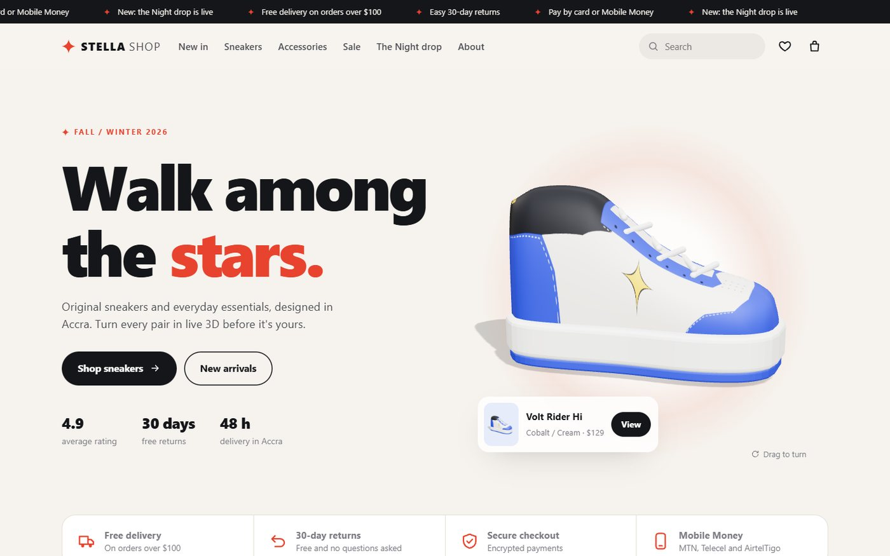
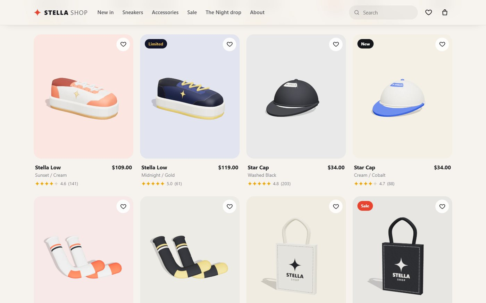
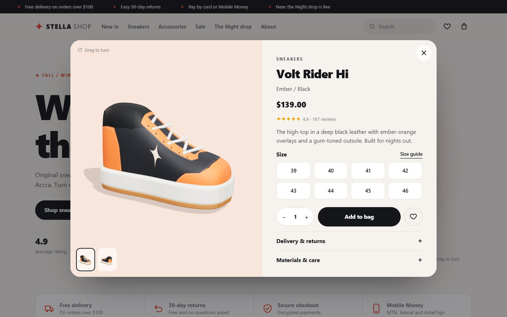
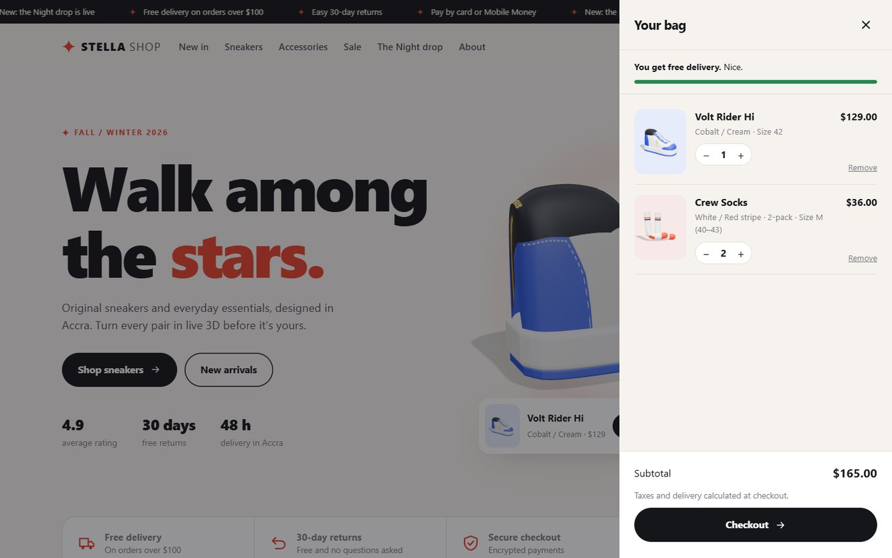
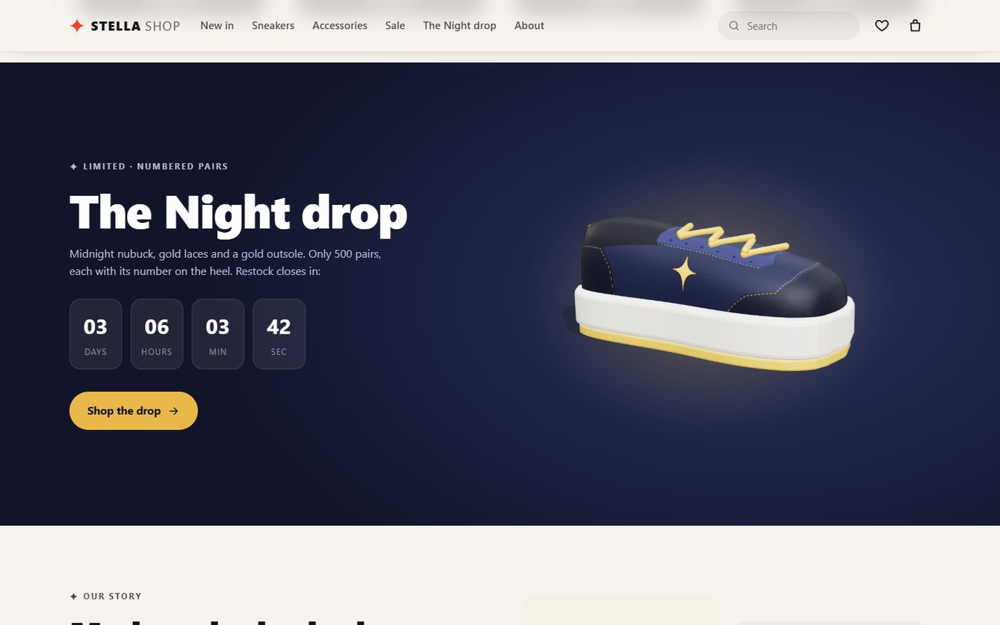
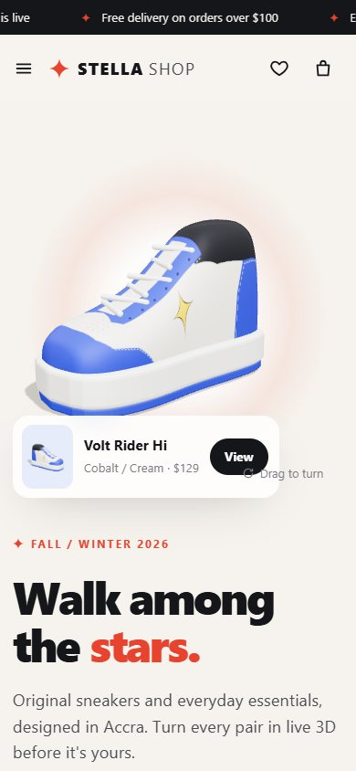

<p align="center">
  
</p>

<h1 align="center">✦ STELLA SHOP</h1>

<p align="center">
  <b>A 3D e-commerce storefront for sneakers and essentials, built with three.js and plain JavaScript.</b><br>
  Every product photo is rendered in the browser from a real 3D model, and every product can be turned in live 3D before it goes in the bag.
</p>

<p align="center">
  
  
  
  
</p>

---

## Highlights

- **Live 3D hero.** The featured sneaker floats and spins in the hero. Drag or swipe to turn it; a flick keeps it spinning, then it settles back into an idle turn.
- **Product photos made in the browser.** Twelve products are rendered from their 3D models on page load, two angles each, in a soft-shadow photo studio. There are no image files and no stock photos.
- **Original 3D models built in code.** High-top and low-top sneakers (a lofted upper with a painted texture, a stitched and lettered side, extruded soles and laces), six-panel caps, flat-lay crew socks and canvas totes. One builder plus a colourway makes a whole product line.
- **A complete shop.** Category tiles, filter chips with counts, live search, sorting, sale and stock badges, ratings, wishlist and bag with quantities, a free-delivery progress bar, and everything saved between visits.
- **3D quick view.** Size picker with validation, quantity, add to bag, wishlist, and delivery and care details, next to a draggable 3D viewer.
- **Made to feel finished.** Sticky header with a blur, scrolling announcement bar, a limited-drop banner with a live countdown, newsletter sign-up with validation, a full footer, toasts, keyboard and screen-reader support, reduced-motion support and a responsive layout from phones to wide screens.
- **Bonus: [Kickdrop](kickdrop/).** A looping product-launch animation: a claw lifts the sneaker out of a phone screen, the countdown hits zero, and the shoe drops into its card and turns into a box with confetti.

## Screenshots

| Product grid | 3D quick view |
|---|---|
|  |  |
| **Shopping bag** | **The Night drop** |
|  |  |

<p align="center"></p>

## Run it

The page uses ES modules, so open it through a local web server rather than as a file:

```bash
# from the project folder, with Python
python -m http.server 8080
# or with Node
npx serve .
```

Then visit <http://localhost:8080>. The Kickdrop animation is at <http://localhost:8080/kickdrop/>.

There is nothing to install and no build step. three.js is included in `vendor/`.

## How it works

```
index.html        page structure, icon sprite, drawers and the quick-view dialog
css/style.css     design tokens, layout, components, responsive rules
js/products.js    the catalogue: names, prices, badges, sizes and each product's 3D colourway
js/models.js      the 3D models (sneaker, cap, socks, tote) and their painted textures
js/studio.js      the photo studio (renders product photos) and the live 3D viewer
js/app.js         the storefront: grid, filters, search, sort, bag, wishlist, quick view
kickdrop/         the product-launch animation
vendor/three/     three.js (MIT licence)
```

- **Photos.** `studio.js` keeps one offscreen WebGL renderer with an environment map, a soft-shadow key light and a shadow-catching floor. Each model is framed automatically from its bounding box and drawn from two angles; the frames are encoded off the main thread with `canvas.toBlob`, so the page stays responsive while the catalogue renders.
- **Viewer.** The hero and quick-view canvases run a small render loop that pauses whenever the canvas is off screen, with pointer drag, inertia, idle spin and a gentle float.
- **Models.** The sneaker upper is a loft of superellipse cross-sections whose height and width follow two spline profiles (one for high-tops, one for lows). Its texture (overlays, stitching, eyelets, perforations and the sparkle mark) is painted on a canvas in the upper's own UV space, so every colourway is just a set of colours.
- **State.** Bag and wishlist live in `localStorage`, so they survive reloads.

## Customise

- **Add a product:** add an entry to `PRODUCTS` in `js/products.js` with a `spec` (`sneaker`, `cap`, `socks` or `tote`) and a colourway. Its photos, card and quick view are created automatically.
- **Change the brand:** colours and type are CSS variables at the top of `css/style.css`. Currency and the free-delivery threshold are at the top of `js/products.js`.

## Notes

This is a demo storefront: products, prices, reviews and checkout are for display only, and checkout isn't connected to payments. All products, designs and the STELLA brand are original to this project.
